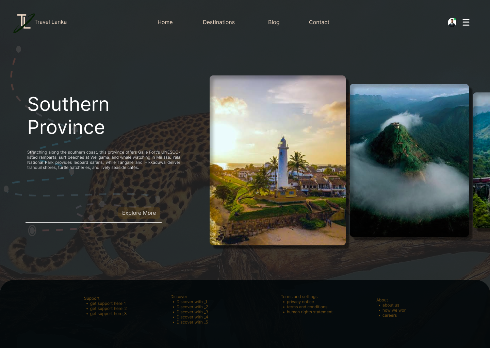
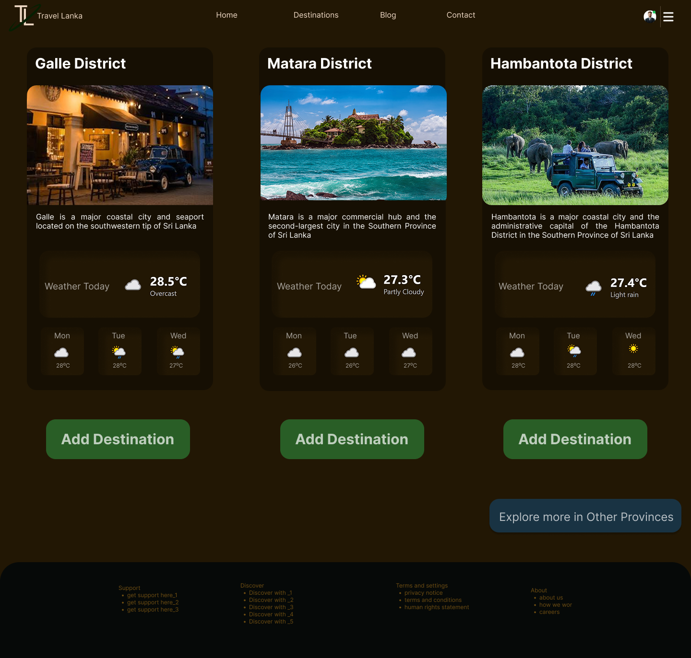
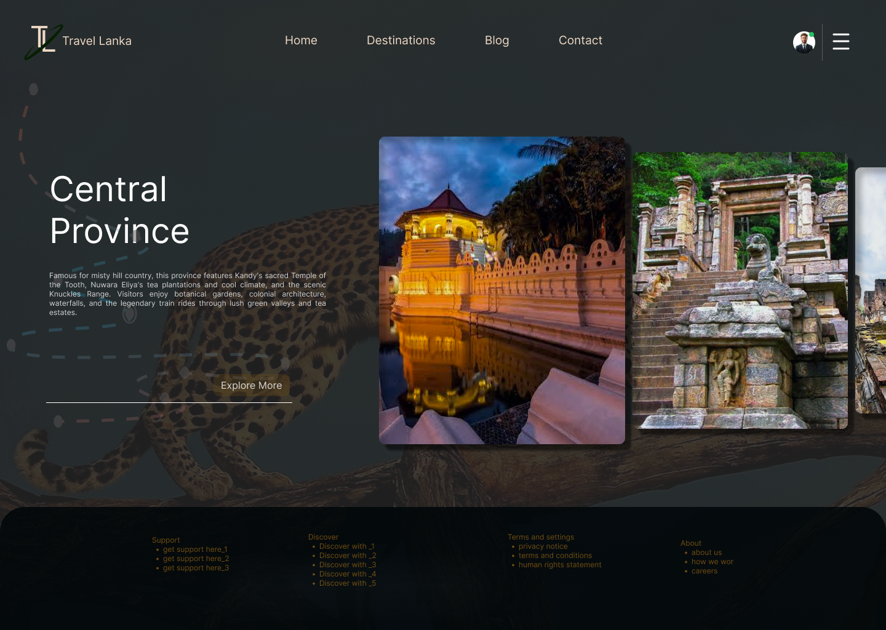
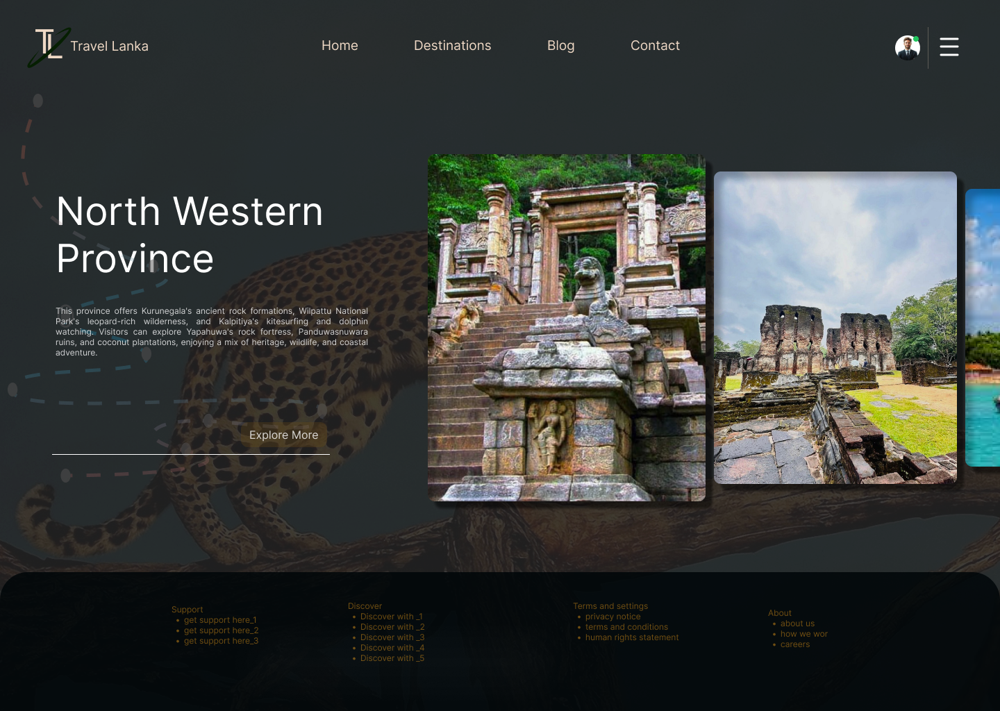

# Travel Lanka – Smart Travel Planning Platform

> A cloud-driven travel platform concept that helps travelers explore Sri Lanka smartly, using **real-time weather**, personal preference, and (in future) optimized travel routes with cost awareness.



**Role:** UI/UX Designer & Front-end Developer
**Type:** Personal concept project
**Focus:** UI/UX Design · System Design · Cloud-Driven · Front-end Development · SaaS

🎨 **Figma Design:** [https://www.figma.com/community/file/1688492095549209683
]
🌐 **Live Demo:** Private demo (hosted on Netlify, API key protected)

---

## About the Product

Travel Lanka is a cloud-based travel platform designed for people who want to explore Sri Lanka smartly.

The core idea is simple but powerful: help travelers choose **provinces and districts** based on **real-time weather** and personal preference, and later get an **optimized travel route** with cost awareness.

I designed the complete user flow and built a working prototype for the **Southern Province** as a proof of concept.

---

## The Problem

Most travel websites in Sri Lanka only show beautiful photos and generic information. Travelers still face these real problems:

- They don't know the current weather in different districts
- They waste time deciding which places to visit
- There is no smart system that helps them create an efficient travel order
- Planning feels scattered and stressful

I wanted to solve this by combining **beautiful design, real data, and smart logic**.

---

## The Solution

**Homepage:** Users swipe through all provinces of Sri Lanka and select any province they are interested in.

**Province Page (Southern Province, fully designed):**

- Shows the main districts: **Galle, Matara, Hambantota**
- Displays **live weather** for each district (today + 3-day forecast)
- Users review the weather and click **"Add Destination"** based on their preference



### Future Intelligent Layer (logic designed, not yet developed)

When a user adds multiple districts:

- The system automatically generates the **most efficient travel order**
- Shows all selected destinations in the user's profile
- Allows the user to choose hotels and re-adjust the plan according to their budget

This combination of **real-time data + user preference + intelligent routing** is the heart of the concept.

---

## What I Built

- Full high-fidelity design in Figma (Homepage + Southern Province)
- Interactive prototype
- Working live weather integration for 3 districts
- Responsive layout
- Clear user flow from province selection to adding destinations

---

## Features

- Clean, premium dark-themed UI
- Real-time weather using WeatherAPI (cloud data)
- Today + 3-day forecast for multiple districts
- Card-based layout with clear information hierarchy
- Responsive design for mobile and desktop
- Scalable structure (one code structure can support all 25 districts)

---

## Tech Stack

| Area | Tools |
|------|-------|
| UI/UX Design | Figma |
| Frontend | HTML, CSS, JavaScript |
| API | WeatherAPI (real-time & forecast data) |
| Tools | VS Code, Netlify (private demo) |

---

## Design Process

1. **User goal first:** What does a traveler actually need when planning a trip to Sri Lanka? Weather information, easy selection and smart planning.
2. **Information architecture:** Homepage (province selection) → Province Page (district + weather) → Profile (saved destinations + optimized plan)
3. **Visual design:** Dark, premium, travel-friendly interface with clear hierarchy so weather information is easy to scan.
4. **Interaction design:** Swipe to explore provinces, open a province page, and add destinations to a personal travel list.
5. **Technical decision:** Used WeatherAPI for real-time and forecast data, and built the page with HTML, CSS and JavaScript in a structure that can scale to all 25 districts.

---

## Challenges & Decisions

| Challenge | Decision |
|-----------|----------|
| Showing weather for multiple districts without a messy page | Clean card-based layout with today's weather highlighted and the next days in smaller boxes |
| API key security | The key is kept in a separate `config.js` that is not committed to GitHub. In a real product, API calls would move to serverless functions |
| Scope of the concept | Fully designed and prototyped the Southern Province experience. Designed the full intelligent system logic but focused development on the most important part (weather + selection) |

---

## Key Learnings

- Good UI is not enough. Real data makes the experience useful.
- Thinking about the full system (even if not fully built) shows product thinking.
- Clear information hierarchy is critical when showing multiple data points (weather + description + actions).
- Security and privacy should be considered from the beginning.

---

## How to Run Locally

1. Clone this repository
```bash
   git clone https://github.com/your-username/travel-lanka.git
   cd travel-lanka
```
2. Get a free API key from [WeatherAPI](https://www.weatherapi.com/)
3. In the `js` folder, copy `config.example.js` and rename the copy to `config.js`
4. Open `config.js` and add your key
```js
   const API_KEY = "YOUR_API_KEY_HERE";
```
5. Open `index.html` in your browser

> ⚠️ `config.js` is listed in `.gitignore`, so your real key is never uploaded. Never commit your real API key.

---

## Project Structure

```
travel-lanka/
├── css/
│   └── style.css
├── images/
├── js/
│   ├── config.example.js
│   └── script.js
├── .gitignore
├── index.html
└── README.md
```

---

## Roadmap

- [ ] Extend weather support to all 25 districts
- [ ] Intelligent route ordering for selected destinations
- [ ] Cost awareness and budget-based plan adjustment
- [ ] Hotel selection and re-adjustable travel plan
- [ ] User profile with saved destinations
- [ ] Serverless backend to protect API keys

---

## About This Project

This project is 100% my original idea. I wanted to create something that feels modern, useful, and uniquely Sri Lankan, a true cloud-driven travel experience. I'm excited to keep developing the intelligent routing and cost optimization features in the future.




**Designed with passion in Figma.**

🔗 [LinkedIn](https://www.linkedin.com/in/chamoda-manamperi/details/projects/edit/forms/132786516) · 

🎨 [Figma_Community](https://www.figma.com/community/file/1686018675136439472) . 

🔗[Behance](https://www.behance.net/gallery/256624131/Travel-Lanka-Cloud-Driven-Travel-Platform) . 

🔗 [Dribble](https://dribbble.com/shots/27782627-Travel-Lanka-Cloud-Driven-Travel-Platform)